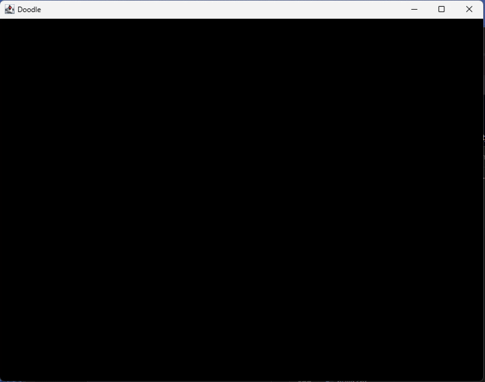

# Hi, I'm Phil Simpson

**Site Reliability Engineer · Platform Engineer**

🏗️ I’m an infrastructure and reliability engineer with over twenty years of experience building and supporting production Linux systems.

🌱 I’m currently studying functional programming.

 
